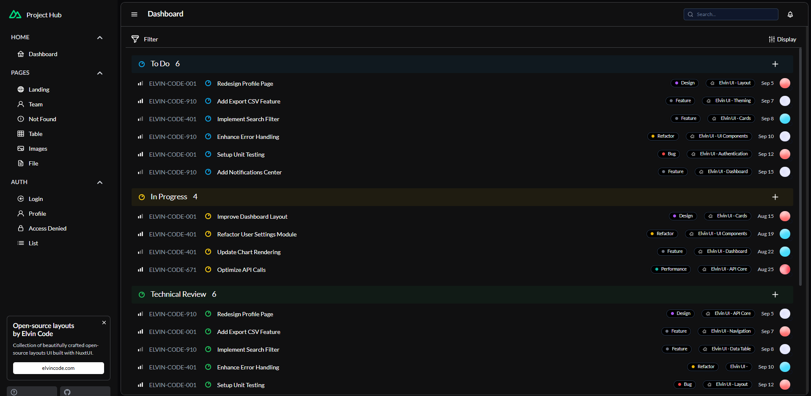
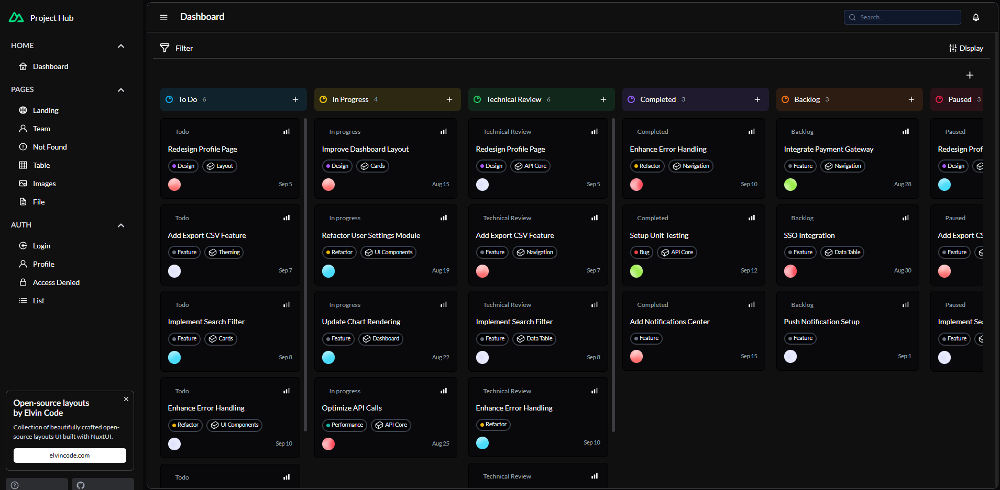

# 📌 Linear Nuxt Fullstack

A **minimal Linear clone** built with **Nuxt 3**, **Pinia**, and **Nuxt UI**.  
**Why?** → To provide a modern, fast, and open-source base for project & task management, inspired by [Linear](https://linear.app).




## 🚀 Features

- 📂 Real-time task & project management  
- 📱 Responsive layout with sidebar  
- 🔔 Inbox & notifications  
- 🎯 Priorities, assignees & drag & drop  
- 🔑 Simple JWT authentication (demo-ready)  
- 🎨 Modern & customizable UI (Nuxt UI)  
- ⚡ Smooth animations with GSAP  

## 🛠️ Installation

Clone and run locally:

```bash
git clone https://github.com/ElvinKyungu/linear-nuxt-fullstack.git
cd linear-nuxt-fullstack
npm install
npm run dev
```

👉 Then open [http://localhost:3000](http://localhost:3000).

## ✨ Usage Examples

Create a task:

```ts
await $fetch('/api/tasks', {
  method: 'POST',
  body: { title: 'New task' }
})
```

Fetch notifications:

```ts
const { data } = await $fetch('/api/inbox')
```

## 🤝 Contributing

Contributions are welcome!

* For small fixes → just open a PR 🚦
* For new features → check [CONTRIBUTING.md](./CONTRIBUTING.md) for guidelines

**TL;DR:**

* Keep PRs small & focused
* Always explain the **why** behind your change
* Run linting before pushing → `npm run lint`

## 🧪 Tests & CI

* ✅ Integration tests are being added for critical features
* 🔄 GitHub Actions CI validates build on each PR

## 💡 Support

If you like this project:

* ⭐ Star the repo
* 🔗 Share it with others
* 💌 Reach out for sponsorship → [elvincode.com](https://elvincode.com)

## 📄 License

MIT © [Elvin Kyungu](https://github.com/ElvinKyungu)
